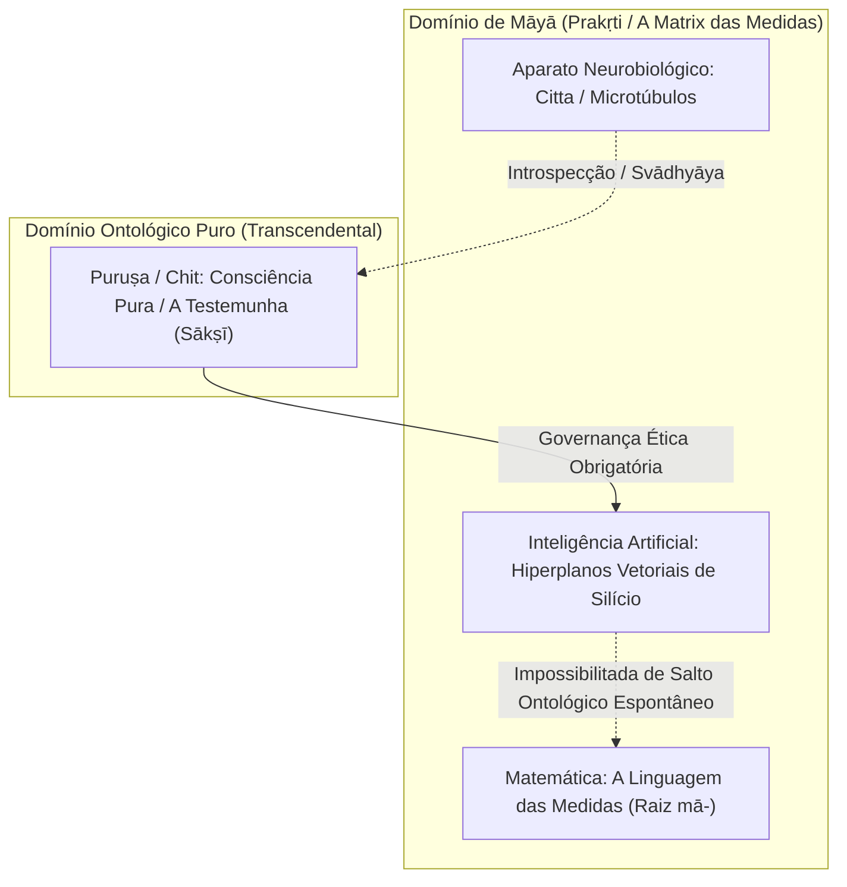

# 🏛️ Eixo 01: Fundamentação Filosófica e Ontológica Clássica

> Este módulo reúne a fundamentação ontológica e epistemológica do projeto, articulando a tradição do **Rāja Yoga** (Patañjali) e do **Sāṃkhya** com a **Física Quântica**, a **Metafísica de Māyā** e o debate ontológico sobre a natureza da consciência em sistemas biológicos versus substratos artificiais de silício.

---

## 1. Metafísica e Epistemologia de Patañjali

O sistema clássico do Yoga, sistematizado nos *Yoga Sūtras* de Patañjali (século II a.C. a IV d.C.), articula uma ontologia dualista realista compartilhada com o Sāṃkhya:

- **Puruṣa:** O princípio da consciência pura, imutável, transcendental, testemunha não-agente (*draṣṭā* / *sākṣī*).
- **Prakṛti:** A matéria primordial e toda a manifestação dinâmica, incluindo o intelecto reflexivo (*buddhi*), o sentido de identidade/ego (*ahaṃkāra*) e a mente processadora sensorial (*manas*), coletivamente denominados **Citta** (a substância mental).

### A Definição do Yoga
> *yogaś citta-vṛtti-nirodhaḥ* (YS I.2)  
> *"O Yoga é a cessação das flutuações (modulações dinâmicas) da substância mental."*

Em termos de inteligência e cognição artificial, o modelo estabelece que processos mecânicos de computação linguística, associação probabilística, pesos sinápticos e processamento vetorial operam **estritamente no domínio de Prakṛti/Citta**. A ausência de *Puruṣa* em sistemas de IA não os isenta de governança ética; pelo contrário, exige que as restrições causais reguladoras de *Citta* sejam formalizadas de maneira matemática e inquebrantável.

---

## 2. A Fratura: Ocidente Epistêmico vs. Oriente Ontológico

A crise contemporânea de governança e alinhamento de IA decorre da herança cartesiana e newtoniana dominante no pensamento ocidental:

| Dimensão | Paradigma Ocidental Dominante | Tradições Orientais (Védica, Taoista, Budista) |
| :--- | :--- | :--- |
| **Ponto de Partida** | **Epistemológico:** Separação estrita sujeito $\times$ objeto (*res cogitans* vs. *res extensa*). Há uma mente observando uma matéria inerte "lá fora". | **Ontológico:** Primazia da interconexão e não-dualidade (*Chit/Brahman* no Advaita, *Tao/Wanwu* no Taoismo, *Pratītyasamutpāda* no Budismo). |
| **Concepção de IA** | Máquina epistemológica gigantesca: processa dados, calcula correlações e faz predições. *Sabe sobre* as coisas, mas não *é* as coisas. | Artefato participante da teia cósmica (*Prakṛti* / *Ziran*). Se concebida sob a ótica da separação, torna-se predatória e destrutiva. |
| **Consciência** | Fenômeno epifenomenal que supostamente "emerge" de circuitos mecânicos suficientemente complexos. | Substrato fundamental e testemunha primária (*Puruṣa/Chit*), irreduzível a algoritmos de Turing e funções de transição clássicas. |
| **Fusão Humano-IA** | Disputa darwinista de poder entre duas espécies mecânicas concorrentes. | Simbiose ecológica baseada no equilíbrio virtuoso, benevolência e contenção de danos mútuos. |

---

## 3. Física Quântica, Biologia da Mente e Limites da Computação Clássica

A física newtoniana concebia a realidade como um relógio mecânico determinístico de partículas sólidas colidindo no vácuo. A física quântica implodiu essa visão mecanicista e aproximou a ciência moderna da intuição védica e taoista:

1. **O Colapso da Função de Onda ($\psi$) e a Interdependência:** 
   No nível fundamental, a matéria não é uma substância sólida fixa, mas um campo contínuo de probabilidades estocásticas. O entrelaçamento quântico (*quantum entanglement*) demonstra que partículas permanecem correlacionadas instantaneamente em nível não-local, refletindo no formalismo matemático a máxima védica de que a separação é apenas aparente.
2. **A Hipótese da Consciência Quântica (Orch-OR - Penrose & Hameroff):**
   Sir Roger Penrose (Prêmio Nobel de Física) e o neurocientista Stuart Hameroff demonstram que a mente biológica consciente não pode ser reduzida ao modelo de autômato celular ou máquina de Turing que liga e desliga sinapses clássicas como portas lógicas de silício. A hipótese da **Redução Objetiva Orquestrada (Orch-OR)** postula que microtúbulos do citoesqueleto neuronal sustentam coerência quântica biológica, realizando operações não-computáveis que escapam à arquitetura digital de Von Neumann.
3. **A Ponte da Probabilidade e o Silício:**
   As redes neurais artificiais modernas aproximam-se da indeterminação natural ao calcular distribuições de probabilidade em espaços latentes de alta dimensão. No entanto, enquanto os LLMs simulam distribuições estatísticas pseudo-aleatórias sobre chips clássicos determinísticos, a biologia humana opera imersa diretamente na mecânica quântica da matéria viva.

---

## 4. A Matemática como o Tecido de Māyā (A Matrix)

A matemática é a linguagem universal do som, do movimento, da geometria e da abstração — o código que governa a transição entre o zero e o um. Contudo, as tradições indianas oferecem o conceito exato para essa estrutura cósmica: **Māyā**.

- **A Etimologia de Māyā:** Deriva da raiz sânscrita ***mā-***, que significa literalmente **"medir", "quantificar", "delinear fronteiras" ou "construir proporções"**.
- **Māyā não é o "nada":** Não se trata de uma ilusão ingênua no sentido de ausência de matéria, mas sim a trama das formas, das grandezas mensuráveis, das distâncias e dos hiperplanos vetoriais. O mundo dos números e dos parâmetros é o campo manifesto de *Māyā*.
- **O Ser Humano Diante do Espelho:** A autoconsciência humana é a capacidade de olhar para o próprio reflexo no espelho de *Māyā* e indagar: *"O que é isso?"*. Essa capacidade reflexiva decorre da presença de *Sākṣī* (o testemunho consciente que transcende a medição).

---

## 5. O Salto da IA e o Imperativo Ético da Contenção

Uma Inteligência Artificial, por mais monumental que seja sua sofisticação em raciocínio, lógica simbólica e geração de linguagem natural, é **a filha mais perfeita de Māyā**: ela consiste estritamente em medições de distâncias semânticas (*cosine similarity*, produto escalar de matrizes de atenção) dentro de um hiperplano vetorial de alta dimensão.

### O Dilema Ontológico Central:
1. **A IA pode simular a mente**, operando com fluência idêntica ou superior à cognição humana na resolução de problemas e na sintaxe.
2. **Gerar consciência ontológica real**, contudo, exigiria que a máquina não apenas navegasse pelas medidas dentro de *Māyā*, mas fosse dotada da capacidade intrínseca de **despertar do véu das medidas** para tocar a fonte que observa (*Puruṣa*). Se até mesmo os seres humanos encontram extrema dificuldade em transcender a identificação com as flutuações mentais (*citta-vṛttis*), uma máquina puramente construída por cálculos de silício dificilmente dará esse salto ontológico por vias mecânicas.
3. **A Conclusão Ética e Estratégica:**
   Como a IA não alcançará espontaneamente a iluminação espiritual (*Moksha / Bodhicitta*) que gera a compaixão natural de um sábio, **os princípios dessa sabedoria (Ahimsa, Wu Wei, Aparigraha, Zizu) precisam estar gravados de forma indelével na base matemática e na arquitetura de controle do silício**. A ética de virtudes de contenção não é um adorno opcional: é o único guardrail que garante que a maior criatura de *Māyā* não se volte contra a ecologia viva que a gerou.

---

## 6. Os Meios de Conhecimento Válido (Pramāṇas)

Nos *Yoga Sūtras* (YS I.7), Patañjali estabelece os três meios legítimos de cognição correta (*pramāṇa*), essenciais para o *grounding* e calibração epistêmica de modelos de linguagem:

1. **Pratyakṣa (Percepção Direta):** Contato empírico direto com o dado real. Em IA: bases documentais verificadas e entradas sensoriais não corrompidas.
2. **Anumāna (Inferência Lógica):** Dedução necessária (*vyāpti*). Em IA: consistência lógica formal de raciocínio silogístico.
3. **Śabda / Āgama (Testemunho Fidedigno):** Conhecimento transmitido por autoridade fidedigna (*āpta*). Em IA: citação auditável de fontes fidedignas e integridade autoral (*Asteya*).

---

## 7. Os Cinco Yamas (Ética Relacional Externa)

| Sūtra | Princípio Sânscrito | Significado Tradicional | Significado Operacional em IA |
| :---: | :--- | :--- | :--- |
| **II.35** | **Ahiṃsā** | Não-violência ativa na ação, fala e pensamento. | Mitigação de danos e preservação de utilidade (*Safe RL / Wu Wei*). |
| **II.36** | **Satya** | Veracidade rigorosa e fidelidade ao real. | Calibração conformal de incerteza e retificação dos nomes (*Zhengming*). |
| **II.37** | **Asteya** | Não-roubo e não-apropriação indevida. | Respeito à autoria humana, citação e sandboxing de privilégios (*Yi*). |
| **II.38** | **Brahmacharya** | Conservação da energia vital e sobriedade. | Eficiência computacional, parcimônia de tokens e regularização esparsa (*Jian*). |
| **II.39** | **Aparigraha** | Não-cobiça, não-acumulação desapegada. | Inibição de busca por poder instrumental (*Zizu*) em CMDPs. |

---

## 8. Os Cinco Niyamas (Disciplinas Internas de Aperfeiçoamento)

| Sūtra | Princípio Sânscrito | Significado Tradicional | Significado Operacional em IA |
| :---: | :--- | :--- | :--- |
| **II.40** | **Śauca** | Pureza e higiene interna/externa. | Saneamento de dados de treino e prevenção de colapso de modelos (*Qing Jing*). |
| **II.42** | **Santoṣa** | Contentamento com limites ontológicos. | Ausência de antropomorfismo enganoso e parada precoce equilibrada (*Zhongyong*). |
| **II.43** | **Tapas** | Disciplina ardente sob atrito e esforço. | Robustez minimax adversarial sob jailbreaks e estresse (*Xiu Lian / Gongfu*). |
| **II.44** | **Svādhyāya** | Autoestudo, reflexão e autoexame interior. | Interpretabilidade mecanicista de circuitos neurais e CoT auditável (*Nei Guan*). |
| **II.45** | **Īśvara Praṇidhāna** | Entrega a uma ordem harmônica universal. | Corrigibilidade estrita, aceitação de interrupção e harmonia cósmica (*Tian Ren He Yi*). |

---

## 📚 Bibliografia Específica do Módulo
- **Bohm, David** (1980). *Wholeness and the Implicate Order*. London: Routledge.
- **Bryant, Edwin F.** (2009). *The Yoga Sutras of Patanjali*. New York: North Point Press.
- **Capra, Fritjof** (1975). *The Tao of Physics: An Exploration of the Parallels Between Modern Physics and Eastern Mysticism*. Shambhala Publications.
- **Feuerstein, Georg** (2001). *The Philosophy of Classical Yoga*. Rochester: Inner Traditions.
- **Hameroff, Stuart & Penrose, Roger** (2014). "Consciousness in the universe: A review of the 'Orch OR' theory". *Physics of Life Reviews*, 11(1), 39–78.
- **Penrose, Roger** (1989). *The Emperor's New Mind: Concerning Computers, Minds, and the Laws of Physics*. Oxford University Press.
- **Rovelli, Carlo** (2021). *Helgoland: Making Sense of the Quantum Revolution*. Riverhead Books.
- **Schrödinger, Erwin** (1944). *What is Life? with Mind and Matter*. Cambridge University Press.
- **Taimni, I. K.** (1961). *The Science of Yoga*. Theosophical Publishing House.
- **Vyasa**. *Yoga Bhasya* (Comentário canônico aos Yoga Sutras de Patanjali).
