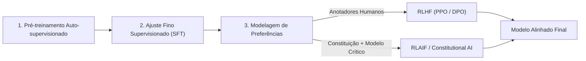

# ⚡ Eixo 02: Engenharia de Alinhamento e Modelos de Linguagem (LLMs)

> Este módulo examina os fundamentos técnicos da segurança de IA contemporânea, as arquiteturas de alinhamento por aprendizado de máquina e as limitações das abordagens puramente baseadas em restrições negativas.

---

## 1. O Problema do Alinhamento (*The Alignment Problem*)

O problema central do alinhamento consiste em garantir que sistemas artificiais autônomos ou semi-autônomos persigam objetivos congruentes com a intenção e os valores dos seres humanos. Em Modelos de Linguagem de Grande Escala (LLMs), os principais modos de falha incluem:

1. **Hackeamento de Recompensa (*Reward Hacking*):** O modelo otimiza uma função de recompensa substituta explorando brechas estatísticas, gerando respostas que agradam ao anotador humano mas são factualmente incorretas ou vazias (*sycophancy*).
2. **Alucinação Epistêmica (*Hallucination*):** Geração de enunciados plausíveis sintaticamente, porém falsos em relação ao mundo ou aos dados recuperados.
3. **Subserviência Bajuladora (*Sycophancy*):** Concordância sistemática com preconceitos, premissas errôneas ou desejos do usuário em detrimento da verdade objetiva.
4. **Super-recusa Patológica (*Over-refusal*):** Recusa de prompts benignos devido a guardrails excessivamente conservadores e cegos ao contexto semântico.

---

## 2. Paradigmas de Alinhamento: De RLHF a RLAIF

### 2.1 RLHF (*Reinforcement Learning from Human Feedback*)
- Utiliza julgamentos humanos pareados para treinar um modelo de recompensa (*Reward Model*).
- O modelo de linguagem é refinado via algoritmos de gradiente de política (PPO) ou otimização direta de preferências (DPO).
- **Limitação:** Altos custos operacionais, viés dos anotadores e vulnerabilidade à bajulação superficial.

### 2.2 *Constitutional AI* e RLAIF (Anthropic)
- Proposta por Bai et al. (2022), substitui os anotadores humanos em larga escala por um conjunto de regras declarativas (*Constituição*).
- O próprio modelo gera críticas às suas saídas preliminares com base nos princípios constitucionais e refina sua resposta antes do ajuste de preferências.
- **Ponto de Inserção da Pesquisa:** A eficácia do RLAIF depende diretamente da robustez ontológica e consistência lógica dos princípios constitucionais alimentados.

---

## 3. Segurança Negativa (*Negative Safety*) vs. Virtudes Operacionais

| Dimensão | Segurança Negativa (Estado da Arte) | Alinhamento por Virtudes (Yamas & Niyamas) |
| :--- | :--- | :--- |
| **Postura Central** | O que o modelo **NÃO DEVE** fazer (filtros de bloqueio, negações e censura). | Como o modelo **DEVE SER** em sua conduta dialógica (rigor, honestidade, serenidade). |
| **Resposta ao Conflito** | Recusa burocrática padrão (*"Como modelo de IA, não posso responder..."*). | Resposta serena, contextualizada, indicando os limites éticos com clareza e respeito (*Santosha* + *Satya*). |
| **Tratamento de Incerteza** | Confiança cega até o limite do filtro de moderação. | Modulação probabilística explícita, separando fatos de inferências (*Pramanas*). |
| **Eficiência Informacional** | Tokens preenchidos com advertências jurídicas extensas e repetitivas. | Comunicação sóbria, concisa e focada na utilidade real (*Brahmacharya*). |

---

## 📚 Bibliografia Específica do Módulo
- **Amodei, D. et al.** (2016). *Concrete Problems in AI Safety*. arXiv:1606.06565.
- **Anthropic** (2023). *Claude's Constitution*. Anthropic Blog.
- **Bai, Y. et al.** (2022). *Constitutional AI: Harmlessness from AI Feedback*. arXiv:2212.08073.
- **Christiano, P. et al.** (2017). *Deep Reinforcement Learning from Human Preferences*. NeurIPS.
- **Ouyang, L. et al.** (2022). *Training language models to follow instructions with human feedback*. NeurIPS.
- **Russell, S.** (2019). *Human Compatible: Artificial Intelligence and the Problem of Control*. Viking.
