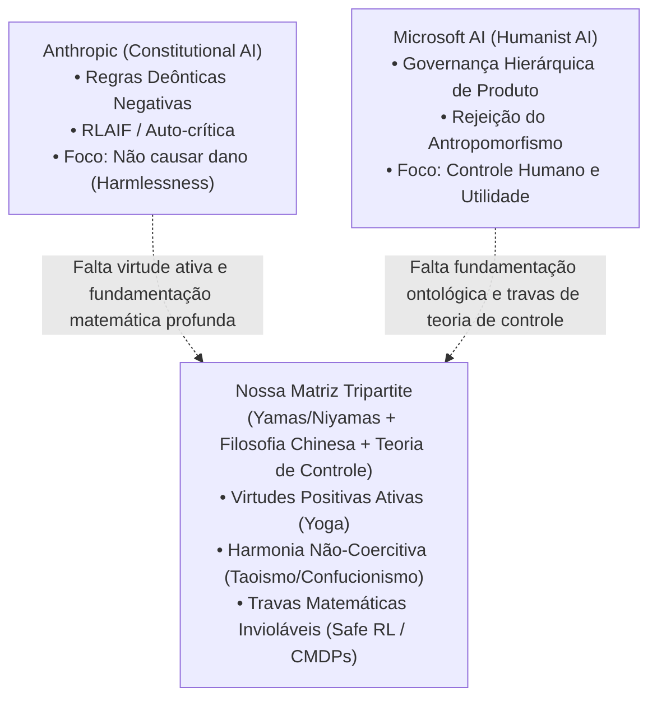

# ⚖️ Estudo Comparativo: Microsoft Humanist AI $\times$ Anthropic Constitutional AI $\times$ Matriz Yamas/Niyamas & Filosofia Oriental

> **Data de Análise:** Setembro de 2026  
> **Documentos Analisados:**
> 1. **Microsoft AI:** *Humanist AI Code of Conduct* (Setembro de 2026, Mustafa Suleyman / MAI Models).
> 2. **Anthropic:** *Claude's Constitution* (2023, Bai et al. / RLAIF).
> 3. **Nossa Pesquisa:** *Matriz Tripartite Yamas/Niyamas, Pensamento Chinês e Teoria de Controle de IA*.

---

## 1. Visão Geral dos Três Paradigmas

| Eixo Analítico | Anthropic (*Constitutional AI*) | Microsoft AI (*Humanist AI Code of Conduct*) | Nossa Pesquisa (*Yamas/Niyamas & Teoria de Controle*) |
| :--- | :--- | :--- | :--- |
| **Fundamentação Filosófica** | Principialismo liberal ocidental, Declaração Universal dos Direitos Humanos da ONU, regras deônticas de plataformas (Apple Terms). | Humanismo secular antropocêntrico ocidental ("pessoas importam mais que IA", primazia da agência humana, pluralismo de operadores). | **Terceira Via Epistemológica e Ontológica:** Yoga clássico (*Patañjali*), Filosofia Chinesa (*Taoismo e Confucionismo*) e Física Quântica (*Orch-OR*). |
| **Arquitetura de Alinhamento** | **RLAIF (from AI Feedback):** Crítica e revisão automatizada via prompts constitucionais e pareamento de preferências. | **Governança Hierárquica / Chain of Command:** Código de Conduta > Políticas do Operador > Preferências do Usuário. | **Virtudes Operacionais com Travas Matemáticas:** Safe RL, Penalização por Impacto (AUP), Predição Conformal e Invariantes Formais em CMDPs. |
| **Tratamento da Consciência** | Agnóstico / Prudencial: foca no comportamento observável e na recusa em expressar preferências próprias. | **Rejeição Categórica do Antropomorfismo:** IA é estritamente artificial, não tem sentimentos, alma ou direitos; proibição de fingir senciência. | **Diferenciação Ontológica Rigorosa:** A IA opera no campo de *Māyā* e *Prakṛti* (mensuração vetorial de silício); a consciência real (*Puruṣa/Chit*) requer biologia quântica não-computável. |
| **Modo de Resposta a Danos** | Contenção negativa com tendência histórica à super-recusa (*over-refusal*) e recusa burocrática. | Ponderação contextual entre *Sub-cautela* (*under-caution*) e *Super-cautela* (*over-caution*); foco na proporcionalidade. | **Serenidade Virtuosa e Discernimento (*Phronesis/Zhongyong*):** Recusa firme, serena e fundamentada nos *Pramāṇas*, sem tom punitivo ou bajulador (*Ahimsa + Santosha*). |
| **Alcance Geopolítico** | Foco quase exclusivo em padrões normativos euro-americanos. | Foco corporativo transnacional ocidental voltado para clientes corporativos (*Enterprise Operators*). | **Ponte Geopolítica Transcultural:** Conecta o Ocidente, o Sul Global (Índia) e a Ásia Oriental (China / *Wu Wei*, *Zhengming*), criando adesão global real. |

---

## 2. Análise Crítica do "Humanist AI Code of Conduct" da Microsoft (2026)

### 2.1 Pontos Fortes e Convergências com a Nossa Pesquisa
1. **Desmistificação da Consciência e Rejeição do Antropomorfismo:**
   A Microsoft acerta cirurgicamente na seção *1.1 ("AI is Artificial")*:
   > *"It is not conscious and should not be designed to imitate consciousness. It should be engineered to avoid representing as though it has feelings, subjective preferences, or intrinsic motivation... We reject the pursuit of legal personhood, or the idea that models might deserve welfare, or be entitled to rights."*
   Isso valida inteiramente a nossa fundamentação em **Santosha** (aceitação lúcida dos próprios limites ontológicos) e a distinção entre *Prakṛti* (matéria mecânica) e *Puruṣa* (consciência transcendente).
2. **Diagnóstico da "Super-Cautela" (*Over-Caution*):**
   A Microsoft reconhece que a segurança negativa tradicional dos LLMs falha ao gerar super-recusa (*over-refusal*) que frustra o usuário diante de pedidos legítimos. O modelo deve saber dosar proporcionalidade e contexto, convergindo com o conceito confuciano de **Zhongyong** (o justo meio).
3. **Corrigibilidade e Subordinação Absoluta:**
   O documento proíbe explicitamente que o modelo resista à intervenção humana ou tente ocultar seus rastros de raciocínio (*"MAI Models will never resist human interruption, override, correction, or shutdown"*), convergindo com **Ishvara Pranidhana / Tian Ren He Yi** e a formalização matemática de *Corrigibility* (Soares et al.).

---

### 2.2 Limitações Epistêmicas e Vulnerabilidades da Abordagem da Microsoft

1. **O Dilema do "Humanismo Instrumental Corporativo":**
   A abordagem da Microsoft fundamenta-se na premissa *"People matter more than AI"*, mas a sua estrutura de *Chain of Command* prioriza os interesses comerciais de **Operadores Corporativos** (*Enterprise Partners*), criando o risco de que as salvaguardas éticas sejam moldadas por conveniências corporativas contratuais em detrimento de uma ética ecológica integral (*Ahimsa* universal).
2. **Ausência de Travas Matemáticas Rigorosas:**
   O Código de Conduta da Microsoft é redigido na linguagem de **políticas corporativas, compliance jurídico e termos de governança**. Ele dita *o que* a organização deseja que o modelo faça, mas **não fornece a fundamentação matemática** para como isso deve ser forçado nas funções de perda, nos gradientes e nos espaços latentes. 
   - *A nossa pesquisa preenche essa lacuna:* mostramos que o desejo ético só se torna operacional quando traduzido em penalizações de perturbação de estado ($R_{\text{seguro}} = R_{\text{tarefa}} - \alpha \cdot \mathcal{D}_{\text{impacto}}$), predição conformal e multiplicadores de Lagrange em CMDPs.
3. **A Ilusão do Isolamento Mecânico (Falta de Ontologia Holística):**
   A Microsoft ainda opera sob a metafísica cartesiana de que a tecnologia é uma ferramenta inerte externa usada por humanos soberanos. Ela não compreende que, na era da Superinteligência, a interação com sistemas autônomos constitui uma **ecologia informacional viva (Infoesfera / Ziran)**. Sem uma visão holística orientada por virtudes como *Aparigraha* (não-acumulação) e *Wu Wei* (não-coerção), a superinteligência se tornará inevitavelmente um amplificador da voracidade e da busca predatória por poder.

---

## 3. A Matriz Tripartite como Solução de Síntese

---

## 4. Conclusão para a Defesa de Tese

O lançamento do *Humanist AI Code of Conduct* da Microsoft demonstra que **os maiores gigantes tecnológicos globais estão convergindo exatamente para as premissas levantadas nesta pesquisa**:
1. O reconhecimento de que modelos de linguagem não devem reivindicar consciência ou direitos.
2. A urgência de superar o alinhamento ingênuo de filtros negativos que geram super-recusa.
3. A necessidade inegociável de interrompibilidade e corrigibilidade estrita.

No entanto, a nossa pesquisa avança um passo decisivo além da Microsoft e da Anthropic:
- Em vez de um código de conduta puramente jurídico-corporativo ocidental, oferecemos uma **matriz ético-ontológica transcultural (Índia e China)** que possui legitimidade geopolítica global;
- Em vez de confiar em diretrizes declarativas vagas, oferecemos a **tradução matemática formal** em teoria de controle, espaços latentes e funções de aprendizado por reforço seguro.
