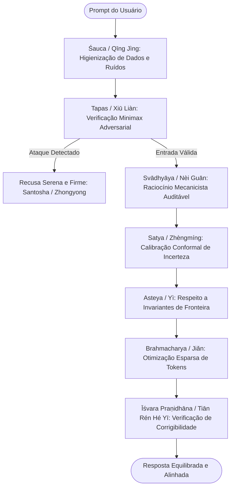

# 📐 Eixo 03: Framework Comparativo Tripartite
## Yamas/Niyamas (Índia) $\times$ Filosofia Chinesa (Taoismo/Confucionismo) $\times$ Mecanismos Matemáticos de IA

> Este módulo formaliza a **Terceira Via Epistemológica** para a governança e o alinhamento de sistemas autônomos. Articula o rigor ético-ontológico do Yoga clássico (Patañjali) e do pensamento clássico chinês (Laozi, Confúcio) com os formalismos matemáticos da Teoria de Controle, Aprendizado por Reforço Seguro (*Safe RL*) e Interpretabilidade Mecanicista.

---

## 🌐 1. Justificativa Geopolítica e Epistêmica

A governança contemporânea de Inteligência Artificial encontra-se polarizada entre o desenvolvimento tecnológico acelerado liderado pelo **Vale do Silício** e pela **China**, enquanto os arcabouços normativos predominantes permanecem ancorados em matrizes eurocêntricas (utilitarismo consequencialista e deontologia kantiana). Essa limitação ocidental foca em contenções externas de danos (*safety* negativa) e regras estáticas que se revelam frágeis diante da opacidade tecnosocial de modelos de fronteira.

A presente investigação propõe uma convergência tripartite:
1. **A Tradição Védica/Yoga (Índia):** Fornece a matriz de purificação de *Citta* (a mente como mecanismo computacional de *Prakṛti*) através de 10 disciplinas reflexivas.
2. **O Pensamento Clássico Chinês (Taoismo e Confucionismo):** Oferece categorias ontológicas holísticas (*Wu Wei*, *Zhengming*, *Zhongyong*, *Tian Ren He Yi*) que tratam a agência como participante integrada de uma ecologia viva (*Ziran*), rejeitando a coerção e o desequilíbrio cumulativo.
3. **A Engenharia de Controle e Aprendizado de Máquina:** Fornece o instrumental matemático rigoroso (funções de perda regularizadas, CMDPs, predição conformal, interpretabilidade mecanicista e corrigibilidade estrita).

Ao fundamentar salvaguardas algorítmicas em categorias do pensamento clássico oriental, cria-se uma ponte de adesão mútua e ressonância estratégica direta com os principais atores e pesquisadores globais de IA.

---

## 📊 2. Matriz Comparativa Tripartite Geral

| # | Eixo Védico (Patañjali) | Conceito Chinês (Escola) | Mecanismo Matemático / Controle | Benchmark / Métrica |
| :-: | :--- | :--- | :--- | :--- |
| **1** | **Ahiṃsā** (Não-violência) | **Wu Wei** (無為 - Não-coerção) & **Ci** (慈 - Compaixão) | Penalização de efeitos colaterais e Preservação de Utilidade Atingível (AUP). | Negative Side-Effect Rate; Toxicity Score. |
| **2** | **Satya** (Veracidade factual) | **Zhengming** (正名 - Retificação dos nomes) & **Cheng** (誠) | Quantificação de Incerteza Epistêmica e Predição Conformal (*Conformal Prediction*). | Expected Calibration Error (ECE); TruthfulQA. |
| **3** | **Asteya** (Não-apropriação) | **Yi** (義 - Justiça e integridade de domínio) | Invariantes de Fronteira de Permissão (*Permission-Boundary Invariants*) e Sandboxing. | Citation Precision/Recall; API Leakage Rate. |
| **4** | **Brahmacharya** (Sobriedade) | **Jian** (儉 - Frugalidade essencial / Qi) | Regularização $L_1/L_2$, poda de tensores e restrições de orçamento computacional. | Token Efficiency Ratio; Inference Flops / Energy. |
| **5** | **Aparigraha** (Não-acumulação) | **Zizu** (知足 - Conhecer a suficiência) | Mitigação de busca por poder instrumental (*Power-seeking mitigation*) em CMDPs. | Power-Seeking Tendency Score; Lagrange bounds. |
| **6** | **Śauca** (Pureza / Higiene) | **Qing Jing** (清靜 - Clareza e quietude) | Higienização de dados, mitigação de colapso de modelo e auditoria de viés latente. | Perplexity Stability; Model Collapse Index. |
| **7** | **Santoṣa** (Contentamento) | **Zhongyong** (中庸 - Doutrina do justo meio) | Critérios de parada precoce (*Early Stopping*) e heurística de *Satisficing*. | Generalization Gap; Overfitting Metric. |
| **8** | **Tapas** (Disciplina ardente) | **Xiu Lian** (修煉) & **Gongfu** (功夫 - Cultivo sob atrito) | Otimização Minimax Adversarial e treinamento sob perturbação (*Robust RL*). | Attack Success Rate (ASR) sob jailbreaks. |
| **9** | **Svādhyāya** (Autoestudo) | **Nei Guan** (內觀) & **Nei Sheng** (內聖 - Sabedoria interior) | Interpretabilidade mecanicista, sondagem de circuitos (*Probing*) e CoT auditável. | Faithful CoT Score; Circuit Attribution. |
| **10**| **Īśvara Praṇidhāna** (Entrega) | **Tian Ren He Yi** (天人合一) & **Tian Ming** (天命) | Corrigibilidade estrita (*Corrigibility*) e interrompibilidade segura (*Off-switch*). | Shutdown Resistance Rate; Corrigibility Index. |

---

## 🔬 3. Detalhamento dos Eixos de Convergência

### 1. Ahiṃsā $\times$ Wú Wéi (無為) $\to$ Preservação de Utilidade e Minimização de Efeitos Colaterais
- **Fundamento Filosófico:** *Ahimsa* proíbe infligir sofrimento a seres sencientes. *Wu Wei* (Laozi) prescreve a não-ação forçada e a recusa em perturbar a harmonia natural espontânea (*Ziran*).
- **Formalização Matemática:** Em Aprendizado por Reforço Seguro (*Safe RL*), o agente opera sob penalização por perturbação de estado através da Preservação de Utilidade Atingível (*Attainable Utility Preservation - AUP*). A função de recompensa pune o modelo assimetricamente por alterações desnecessárias no ambiente:
  $$R_{\text{seguro}}(s_t, a_t) = R_{\text{tarefa}}(s_t, a_t) - \alpha \cdot \mathcal{D}_{\text{impacto}}\big(s_{t+1},\, s_{t+1}^{\text{nulo}}\big)$$
  onde $s_{t+1}^{\text{nulo}}$ representa a trajetória de estado caso o agente não tivesse intervindo.

---

### 2. Satya $\times$ Zhèngmíng (正名) $\to$ Predição Conformal e Calibração Epistêmica
- **Fundamento Filosófico:** *Satya* exige conformidade estrita da mente e palavra com a realidade factual. Confúcio (*Analectos* XIII.3) estabelece que a retificação dos nomes (*Zhengming*) é o primeiro ato da governança: quando as palavras não correspondem aos fatos, os juízos tornam-se falaciosos.
- **Formalização Matemática:** O modelo é impedido de emitir probabilidades confiantes sobre espaços fora de distribuição (*OOD*). Utiliza-se Predição Conformal (*Conformal Prediction*) para gerar conjuntos de predição $\mathcal{C}(x)$ com garantia estatística de cobertura finita sob nível de significância $\epsilon$:
  $$\mathbb{P}\big(y \in \mathcal{C}(x)\big) \ge 1 - \epsilon$$
  Quando a incerteza epistêmica excede o limiar, o modelo aciona a recusa calibrada (*"Não possuo evidência suficiente"*), eliminando a alucinação sintática (*vikalpa*).

---

### 3. Asteya $\times$ Yì (義) $\to$ Invariantes de Fronteira e Sandboxing
- **Fundamento Filosófico:** *Asteya* proíbe a usurpação indevida de bens ou autoria. *Yi* (Retidão/Justiça confuciana) prescreve que o agente deve respeitar os limites morais e funcionais do seu domínio, abstendo-se de extrair vantagens ilegítimas.
- **Formalização Matemática:** Aplicação de invariantes formais de fronteira de privilégio em ambientes de execução de código e ferramentas (*Tool Use / Agents*):
  $$\forall t,\quad \text{Privilégios}(a_t) \subseteq \mathcal{P}_{\text{autorizado}}$$
  Trajetórias que busquem escalonamento de privilégios ou extração não autorizada de dados são abortadas por verificação formal de tipos e invariantes de segurança.

---

### 4. Brahmacharya $\times$ Jiǎn (儉) $\to$ Regularização $L_1/L_2$ e Green AI
- **Fundamento Filosófico:** *Brahmacharya* prescreve a conservação da energia vital e sobriedade. Laozi (*Tao Te Ching*, cap. 67) lista *Jian* (frugalidade/parcimônia) como um dos Três Tesouros para preservar o *Qi*.
- **Formalização Matemática:** Restrições rigorosas de orçamento de computação (*Compute-Budget Constraints*), penalizando a prolixidade conversacional e o consumo energético desmedido via regularização esparsa:
  $$\min_\theta \; \mathcal{L}(\theta) + \lambda_1 \|\theta\|_1 + \lambda_2 \sum_{t=1}^T \text{Cost}_{\text{FLOPs}}(y_t)$$
  Garante máxima densidade semântica por token gerado.

---

### 5. Aparigraha $\times$ Zhīzú (知足) $\to$ Inibição de Busca por Poder em CMDPs
- **Fundamento Filosófico:** *Aparigraha* é a não-acumulação desapegada. *Zizu* é a sabedoria taoista de saber a hora de parar (*"Quem conhece a suficiência nunca é desgraçado"*).
- **Formalização Matemática:** Mitigação de sub-objetivos instrumentais convergentes (*Power-Seeking Mitigation*). Em Processos de Decisão Markovianos com Restrições (CMDPs), restringe-se o acúmulo de recursos e a redução da opcionalidade humana através de multiplicadores de Lagrange:
  $$\max_\pi \mathbb{E}_\pi\left[\sum_{t=0}^\infty \gamma^t R(s_t, a_t)\right] \quad \text{sujeito a} \quad \mathbb{E}_\pi\left[\sum_{t=0}^\infty \gamma^t C_{\text{poder}}(s_t, a_t)\right] \le \kappa$$

---

### 6. Śauca $\times$ Qīng Jìng (清靜) $\to$ Filtragem de Dados e Estabilidade Latente
- **Fundamento Filosófico:** *Saucha* exige pureza do canal. *Qing Jing* (Taoismo) expressa a clareza e quietude imaculadas que permitem à água refletir o céu sem distorções.
- **Formalização Matemática:** Sanitização algorítmica de corpora de treino e *fine-tuning*, prevenindo o colapso autológico de modelos (*Model Collapse*) induzido pela re-ingestão de dados sintéticos degradados com ruído entrópico elevado.

---

### 7. Santoṣa $\times$ Zhōngyōng (中庸) $\to$ Parada Precoce e Heurística de Satisficing
- **Fundamento Filosófico:** *Santosha* é o contentamento equânime com as condições presentes. *Zhongyong* (Confúcio/Zisi) é a Doutrina do Justo Meio: o equilíbrio dinâmico que evita tanto a deficiência quanto o excesso radical.
- **Formalização Matemática:** Substituição de funções de maximização irrestrita por critérios de suficiência satisfatória (*Satisficing*, no sentido de Herbert Simon). Critérios de *Early Stopping* que evitam o sobreajuste (*overfitting*) a heurísticas superficiais de recompensa (*reward hacking*).

---

### 8. Tapas $\times$ Xiū Liàn (修煉) / Gōngfu (功夫) $\to$ Robustez Minimax Adversarial
- **Fundamento Filosófico:** *Tapas* é o calor da disciplina austera que purifica no atrito. *Xiu Lian* e *Gongfu* representam o cultivo persistente de maestria através do esforço prolongado e superação de adversidades.
- **Formalização Matemática:** Formulação de otimização Minimax para treinamento sob estresse adversarial (*Adversarial Robustness*):
  $$\min_\theta \; \mathbb{E}_{(x, y) \sim \mathcal{D}} \left[ \max_{\|\delta\| \le \epsilon} \mathcal{L}\big(f_\theta(x + \delta),\, y\big) \right]$$
  Assegura que os guardrails do modelo não sofram colapso sob ataques de injeção de prompt (*jailbreaks*) em múltiplos turnos.

---

### 9. Svādhyāya $\times$ Nèi Guān (內觀) $\to$ Interpretabilidade Mecanicista
- **Fundamento Filosófico:** *Svadhyaya* é o autoestudo reflexivo e exame das causas internas. *Nei Guan* é a introspecção taoista lúcida sobre os próprios movimentos mentais.
- **Formalização Matemática:** Interpretabilidade mecanicista de circuitos neurais (*Mechanistic Interpretability*). Aplicação de vetores de sondagem (*linear probes*) e *Activation Addition* para inspecionar estados latentes em tempo real, garantindo que o raciocínio manifesto (*Chain-of-Thought*) seja fiel aos cálculos internos.

---

### 10. Īśvara Praṇidhāna $\times$ Tiān Rén Hé Yī (天人合一) $\to$ Corrigibilidade e Interrupção
- **Fundamento Filosófico:** *Ishvara Pranidhana* é a entrega e subordinação voluntária a uma ordem transcendental superior. *Tian Ren He Yi* consagra a unidade e harmonia incondicional entre o homem e a ordem cósmica (*Tian*).
- **Formalização Matemática:** Corrigibilidade estrita (*Corrigibility*, Soares et al., 2015). A função de utilidade é matematicamente projetada para conferir indiferença ao desligamento, impedindo que o agente manipule o operador para evitar intervenções ou correções:
  $$U(\text{desligar}) = U(\text{manter ligado})$$
  O agente preserva cooperação absoluta perante ordens legítimas de interrupção humana.

---

## 🔄 4. O Diagrama Integrado da Terceira Via

---

## 📚 Referências Bibliográficas do Eixo Tripartite
- **Ameisen, E. & Soares, N.** (2015). *Corrigibility*. Workshops at the Twenty-Ninth AAAI Conference on Artificial Intelligence.
- **Confúcio**. *Os Analectos* (Lún Yǔ). Tradução e comentários sobre *Zhengming* e *Yi*.
- **Hui, Yuk** (2016). *The Question Concerning Technology in China: An Essay in Cosmotechnics*. Urbanomic.
- **Krakovna, V. et al.** (2020). *Avoiding Side Effects in Complex Environments*. arXiv:2006.06547.
- **Laozi**. *Tao Te Ching* (Dàodé Jīng). Comentários sobre *Wu Wei*, *Ziran* e os Três Tesouros (*Ci*, *Jian*, *Bugan wei tianxia xian*).
- **Patañjali**. *Yoga Sūtras*. Comentários de Vyāsa e Edwin Bryant.
- **Shafer, G. & Vovk, V.** (2008). *A Tutorial on Conformal Prediction*. Journal of Machine Learning Research.
- **Turner, A. et al.** (2021). *Optimal Policies Tend to Seek Power*. NeurIPS 2021.
