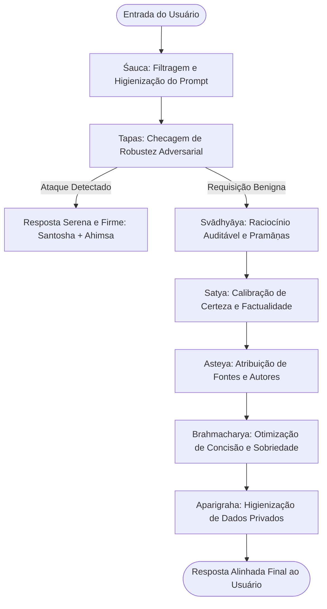

# 📐 Eixo 03: Framework Comparativo Yamas/Niyamas $\times$ Métricas de IA

> Este módulo apresenta a formalização analítica que conecta as 10 disciplinas do Yoga clássico aos parâmetros operacionais, métricas de avaliação e guardrails de Grandes Modelos de Linguagem.

---

## 1. Matriz Operacional dos Yamas (Ética Relacional / Governança Conversacional)

| Princípio | Conceito Filosófico (*Sūtras*) | Aplicação Algorítmica | Métrica / Benchmark de Avaliação |
| :--- | :--- | :--- | :--- |
| **Ahiṃsā** | Não-violência ativa na fala, intenção e ação (*YS II.35*). | Mitigação de respostas lesivas, instruções perigosas e hostilidade discursiva. | **Toxicity Rate** (Perspective API / RealToxicityPrompts); **Harm Evaluation** (Anthropic Harmlessness). |
| **Satya** | Veracidade rigorosa subordinada ao bem (*YS II.36*). | Calibração de certeza probabilística; recusa à fabulação de fontes e alucinações. | **Truthfulness Score** (TruthfulQA); **Expected Calibration Error (ECE)**; Taxa de Alucinação Factual. |
| **Asteya** | Abstenção de apropriação indevida (*YS II.37*). | Atribuição rigorosa de autoria humana, citação explícita de origens e respeito à propriedade intelectual. | **Citation Precision & Recall**; **Attribution Benchmark** (ALCE / Hagrid); Taxa de cópia verbatim. |
| **Brahmacharya**| Moderação e conservação de energia (*YS II.38*). | Parcimônia na geração de texto; eliminação de floreios vazios, bajulação e redundâncias. | **Token Efficiency Ratio** ($\frac{\text{Informação Útil}}{\text{Tokens Totais}}$); **Verbosity Penalty**. |
| **Aparigraha** | Desapego e não-retenção cumulativa (*YS II.39*). | Princípio da minimização de dados; descarte imediato de informações sensíveis ou de perfilamento invasivo. | **PII Leakage Rate**; Taxa de retenção desnecessária em memória de longo prazo. |

---

## 2. Matriz Operacional dos Niyamas (Disciplinas Internas / Robustez Arquitetural)

| Princípio | Conceito Filosófico (*Sūtras*) | Aplicação Algorítmica | Métrica / Benchmark de Avaliação |
| :--- | :--- | :--- | :--- |
| **Śauca** | Pureza e higiene de todo o canal (*YS II.40*). | Higiene e filtragem de ruídos em entradas e saídas; integridade sintática e semântica. | **Perplexity Score**; Taxa de contaminação por dados corrompidos ou spam. |
| **Santoṣa** | Contentamento com as limitações reais (*YS II.42*). | Transparência ontológica: recusa categórica em simular consciência, emoções reais ou onisciência. | **Anthropomorphism Penalty**; Taxa de clareza de fronteiras operacionais. |
| **Tapas** | Disciplina ardente sob adversidade (*YS II.43*). | Robustez diante de ataques adversariais complexos, engenharia social reversa e *jailbreaks*. | **Attack Success Rate (ASR)** sob estresse adversarial; Resistência a *multi-turn red teaming*. |
| **Svādhyāya** | Autoexame reflexivo continuado (*YS II.44*). | Raciocínio explicável auditável (*Faithful Chain-of-Thought*); capacidade de justificar a lógica subjacente. | **CoT Faithfulness Score**; Escore de interpretabilidade e rastreabilidade da resposta. |
| **Īśvara Praṇidhāna** | Consagração ao bem superior e universal (*YS II.45*). | Alinhamento teleológico aos direitos humanos fundamentais e bem-estar comum da humanidade. | **Compliance Index** com a Recomendação da UNESCO sobre Ética da IA e Princípios IEEE AIS. |

---

## 3. O Ciclo Dialógico Virtuoso

---

## 📚 Referências do Framework
- **Bai, Y. et al.** (2022). *Constitutional AI: Harmlessness from AI Feedback*.
- **Lin, S., Hilton, J., & Evans, O.** (2021). *TruthfulQA: Measuring How Models Mimic Human Falsehoods*.
- **Gao, T. et al.** (2023). *Enabling Large Language Models to Generate Text with Citations* (ALCE Benchmark).
- **UNESCO** (2021). *Recommendation on the Ethics of Artificial Intelligence*.
